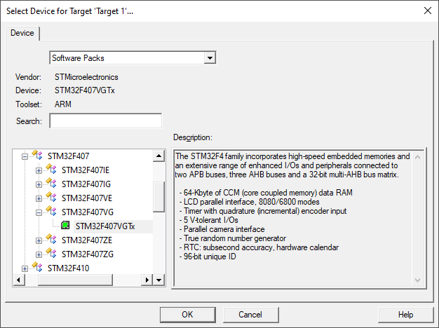
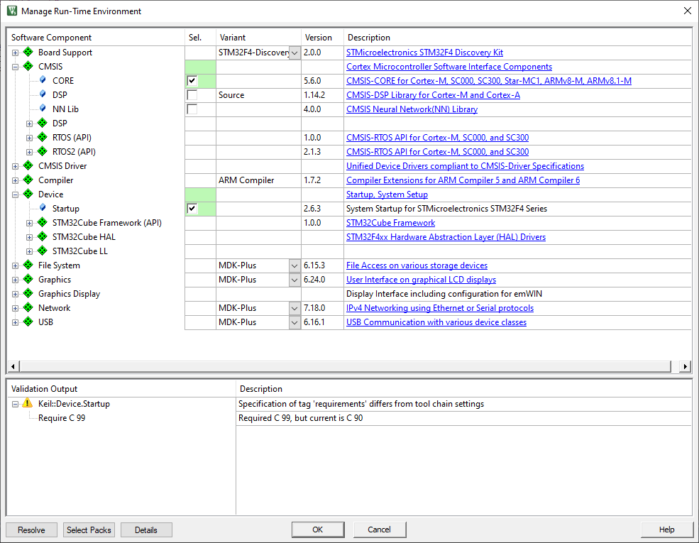
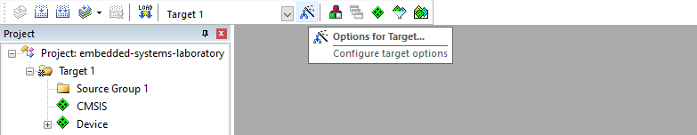
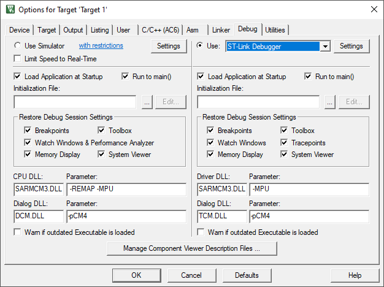
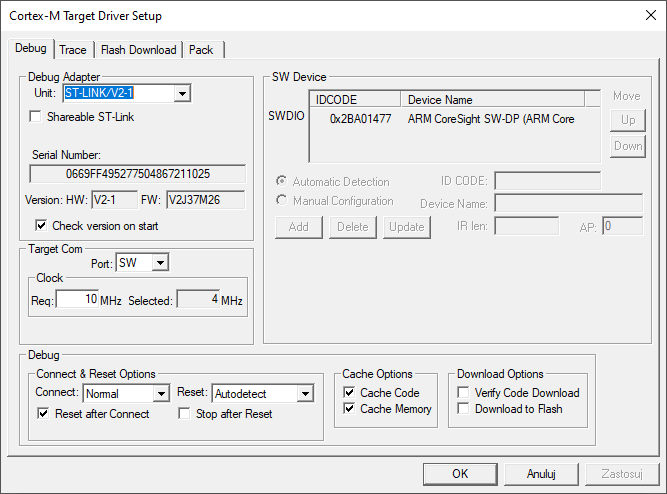
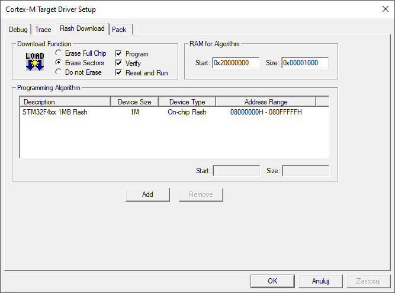
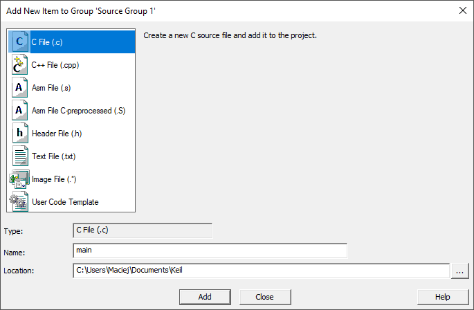
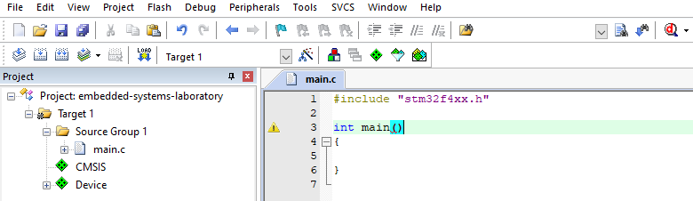
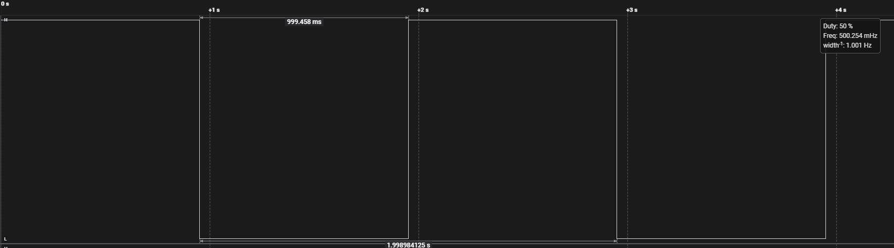
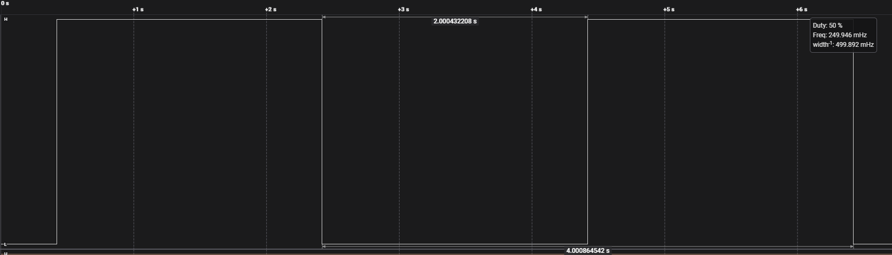

# Embedded-Systems

Repository Embedded-Systems presents suggested solutions to tasks that had to be completed in the first semester of my Master's studies within the Embedded-Systems course at the Wroclaw University of Technology in the field of Control Engineering and Robotics. The tasks were implemented on the `STM32F407G-DISC1` board equipped with the `STM32F407VG` core. The `Keil µVision 5 IDE` was used to program the board.

## Table of Contents

  - [Project Setup](#project-setup)
  - [Task *A*](#task-a)
  - [Task *B*](#task-b)
  - [Task *C*](#task-c)
  - [Task *D*](#task-d)
  - [Task *E*](#task-e)

## Project Setup

The first step is to create a new project. From the `Keil µVision 5` program bar, select `Project` and then `New µVision Project...`. Then a window will appear where you can define the name of the project.


After defining the name of the project, select the device to be programmed. In this case, select `STMicroelectronics -> STM32F4 Series -> STM32F407 -> STM32F407VG -> STM32F407VGTx`



Then the `Manage Run-Time Environment` window appears, in which checkboxes presented in the screenshot below should be checked. In addition, in `Board Support`, select the `STM32F4-Discovery` option.



The next step is to set the appropriate settings for the debugger. Select `Options for Target...` from the program bar.



There, go to the `Debug` tab and select the option shown in the screenshot below, i.e. `ST-Link Debugger`.



To verify the correct connection with the board, click the `Settings` button visible to the right of the name of the selected debugger. If everything works correctly, the window should contain the following information.



To make it easier to work with the board, you can go to the `Flash Download` tab and check the `Reset and Run` option. This will automatically reset the board when loading a new program.



The last step of project configuration is to create the `main.c` file in which the program code will be written.






## Task *A*

The task is to turn on the selected LEDs available on the board. In the example shown below, all LEDs are turned on.

```c
#include "stm32f4xx.h"

int main()
{
    // Enable the clock of port D of the GPIO
    RCC->AHB1ENR |= RCC_AHB1ENR_GPIODEN;

    // Set 12-15 pins as output
    GPIOD->MODER |= GPIO_MODER_MODER12_0;
    GPIOD->MODER |= GPIO_MODER_MODER13_0;
    GPIOD->MODER |= GPIO_MODER_MODER14_0;
    GPIOD->MODER |= GPIO_MODER_MODER15_0;

    // Turn on LEDs
    GPIOD->ODR |= GPIO_ODR_OD12;
    GPIOD->ODR |= GPIO_ODR_OD13;
    GPIOD->ODR |= GPIO_ODR_OD14;
    GPIOD->ODR |= GPIO_ODR_OD15;
}
```
## Task *B*

The task is to blink selected LEDs available on the board using the system tick timer `SysTick`. The LED should be on for 1 second and then off for another second. To achieve this, you need to configure `SysTick` and check the status of the `COUNTFLAG` bit in `SysTick->CTRL` register. The documentation says that `SysTick` by default runs at the `HSI` frequency divided by 8. Thus, it is *16MHz/8 = 2MHz*. To calculate the value of the `LOAD` register, you can use the following formula:

```
SysTick->LOAD = System Clock x Delay Desired
```

Applying the above formula in our problem, we get:

```
SysTick->LOAD = 2MHz x 1s = 2 000 000
```

In the code, the obtained value should be reduced by 1, because the counting starts from zero.

```c
#include "stm32f4xx.h"

int main()
{
	// Enable the clock of port D of the GPIO
	RCC->AHB1ENR |= RCC_AHB1ENR_GPIODEN;
	
	// Set 12-15 pins as output
	GPIOD->MODER |= GPIO_MODER_MODER12_0;
	GPIOD->MODER |= GPIO_MODER_MODER13_0;
	GPIOD->MODER |= GPIO_MODER_MODER14_0;
	GPIOD->MODER |= GPIO_MODER_MODER15_0;
	
	// Set SysTick LOAD
	SysTick->LOAD = 2000000 - 1;
	
	// Clear current value
	SysTick->VAL = 0;
	
	// Enable SysTick
	SysTick->CTRL |= SysTick_CTRL_ENABLE_Msk;
	
	while(1)
	{
		if(SysTick->CTRL & SysTick_CTRL_COUNTFLAG_Msk)
		{
			GPIOD->ODR ^= GPIO_ODR_OD12;
			GPIOD->ODR ^= GPIO_ODR_OD13;
			GPIOD->ODR ^= GPIO_ODR_OD14;
			GPIOD->ODR ^= GPIO_ODR_OD15;
		}
	}
}
```

The screenshot below shows the logical states of the output controlling one of the four LEDs.



## Task *C*

The task is analogous to the previous one, but instead of checking the `COUNTFLAG` bit, the code related to the change of the diode state should be implemented in the interrupt.

```C
#include "stm32f4xx.h"

void SysTick_Handler(void)
{
	GPIOD->ODR ^= GPIO_ODR_OD12;
	GPIOD->ODR ^= GPIO_ODR_OD13;
	GPIOD->ODR ^= GPIO_ODR_OD14;
	GPIOD->ODR ^= GPIO_ODR_OD15;
}

int main()
{
	// Enable the clock of port D of the GPIO
	RCC->AHB1ENR |= RCC_AHB1ENR_GPIODEN; 
	
	// Set 12-15 pins as output
	GPIOD->MODER |= GPIO_MODER_MODER12_0;
	GPIOD->MODER |= GPIO_MODER_MODER13_0;
	GPIOD->MODER |= GPIO_MODER_MODER14_0;
	GPIOD->MODER |= GPIO_MODER_MODER15_0;
	
	// Set SysTick LOAD
	SysTick->LOAD = 2000000 - 1;
	
	// Clear current value
	SysTick->VAL = 0;
	
	// Enable SysTick
	SysTick->CTRL |= SysTick_CTRL_ENABLE_Msk;
	
	// Enable SysTick interrupt
	SysTick->CTRL |= SysTick_CTRL_TICKINT_Msk;

	while(1)
	{

	}
}
```

## Task *D*

In this task, you configure the `HSE` *(high-speed external oscillator)* and `HSI` *(high-speed internal oscillator)* clocks. `HSI` is the default system clock on the board, so it is automatically configured at device startup. To check the configuration, you can activate the `HSE` clock, set it as the system clock, and then disable the `HSI` clock. The clock frequency of the external oscillator is *8MHz*, so the `SysTick` clock is *8MHz/8 = 1MHz*. Thus, using the example of blinking a LED from the previous tasks, the time of its high and low state should be extended to 2 seconds while maintaining the same `SysTick` configuration.

```C
#include "stm32f4xx.h"

void SysTick_Handler(void)
{
	GPIOD->ODR ^= GPIO_ODR_OD12;
}

int main()
{
	// Enable the clock of port D of the GPIO
	RCC->AHB1ENR |= RCC_AHB1ENR_GPIODEN;
	
	// Set pin 12 as output
	GPIOD->MODER |= GPIO_MODER_MODER12_0;
	
	// Enable HSE clock
	RCC->CR |= RCC_CR_HSEON_Msk;
	while(!(RCC->CR & RCC_CR_HSERDY_Msk));
	
	// Set HSE as system clock
	RCC->CFGR |= RCC_CFGR_SW_HSE;
	while(!(RCC->CFGR & RCC_CFGR_SWS_HSE));
	
	// Disable HSI clock
	RCC->CR &= ~RCC_CR_HSION_Msk;
	while(RCC->CR & RCC_CR_HSIRDY_Msk);
	
	// Set SysTick LOAD
	SysTick->LOAD = 2000000 - 1;
	
	// Clear current value
	SysTick->VAL = 0;
	
	// Enable SysTick
	SysTick->CTRL |= SysTick_CTRL_ENABLE_Msk;
	
	// Enable SysTick interrupt
	SysTick->CTRL |= SysTick_CTRL_TICKINT_Msk;
	
	while(1)
	{

	}
}
```



## Task *E*

Configure `PLL`. You can use `SystemCoreClockUpdate()` function to validate frequency of the clock. But if you want to get reliable results you have to change default value of `HSI_VALUE` constant in `system_stm32f4xx.c` file.

Defualt configuration:

```C
#if !defined  (HSE_VALUE) 
  #define HSE_VALUE    ((uint32_t)25000000) /*!< Default value of the External oscillator in Hz */
#endif /* HSE_VALUE */
```

Changed HSE_VALUE to 8MHz:
```C
#if !defined  (HSE_VALUE) 
  #define HSE_VALUE    ((uint32_t)8000000) /*!< Default value of the External oscillator in Hz */
#endif /* HSE_VALUE */
```

The step described above is not necessary but it would help verify whether the frequency of the clock is set correctly.

```C
#include "stm32f4xx.h"

void ConfigurePllClock(unsigned char frequency);

volatile uint32_t systickCounter = 0;

void SysTick_Handler(void)
{
	systickCounter++;
	
	if(systickCounter == 1000)
	{
		GPIOD->ODR ^= GPIO_ODR_OD12;
		GPIOD->ODR ^= GPIO_ODR_OD13;
		GPIOD->ODR ^= GPIO_ODR_OD14;
		GPIOD->ODR ^= GPIO_ODR_OD15;
		systickCounter = 0;
	}
}

void ConfigurePllClock(unsigned char frequency)
{
	
	// Enable HSI clock
	RCC->CR |= RCC_CR_HSION;
	while(!(RCC->CR & RCC_CR_HSIRDY));
	
	// Set HSI as system clock
	RCC->CFGR &= ~RCC_CFGR_SW;
	while(RCC->CFGR & RCC_CFGR_SWS_HSI);
	
	// Enable HSE clock
	RCC->CR |= RCC_CR_HSEON;    				
	while(!(RCC->CR & RCC_CR_HSERDY));

	//Disable PLL
	RCC->CR &= ~RCC_CR_PLLON;
	
	// Configure PLL 
	RCC->PLLCFGR |= RCC_PLLCFGR_PLLSRC_HSE;   // PLL source is HSE (8 MHz crystal)

	// Set PLLM divider to 4 so 8MHz/4 = 2MHz on VCO input
	RCC->PLLCFGR &= ~(RCC_PLLCFGR_PLLM); // Clear PLLM
	RCC->PLLCFGR |= RCC_PLLCFGR_PLLM_2; // Set divider to 4
		
	RCC->PLLCFGR &= ~(RCC_PLLCFGR_PLLN); // Clear PLLN 
	RCC->PLLCFGR &= ~(RCC_PLLCFGR_PLLP); // Clear PLLM - 00 is divider by 2
	
	if(frequency > 50)
	{
		// Set PLLN multiplier to frequency so 2MHz * frequency on VCO output
		RCC->PLLCFGR |= (frequency << RCC_PLLCFGR_PLLN_Pos);
	}
	else if(frequency > 25)
	{
		// Set PLLN multiplier to frequency so 2MHz * frequency on VCO output
		RCC->PLLCFGR |= ((2*frequency) << RCC_PLLCFGR_PLLN_Pos);
	
		// Set PLLP divider to 4
		RCC->PLLCFGR |= RCC_PLLCFGR_PLLP_0;
	}
	else
	{
		// Set PLLN multiplier to frequency so 2MHz * frequency on VCO output
		RCC->PLLCFGR |= ((4*frequency) << RCC_PLLCFGR_PLLN_Pos);
	
		// Set PLLP divider to 8
		RCC->PLLCFGR |= RCC_PLLCFGR_PLLP_0;
		RCC->PLLCFGR |= RCC_PLLCFGR_PLLP_1;
	}

	// Enable PLL 
	RCC->CR |= RCC_CR_PLLON;
	while(!(RCC->CR & RCC_CR_PLLRDY));

	// Configure flash latency 
	FLASH->ACR &= ~(FLASH_ACR_LATENCY);
	
	if(frequency > 150)
	{
		FLASH->ACR |= FLASH_ACR_LATENCY_5WS;
	}
	else if(frequency > 120)
	{
		FLASH->ACR |= FLASH_ACR_LATENCY_4WS;
	}
	else if(frequency > 90)
	{
		FLASH->ACR |= FLASH_ACR_LATENCY_3WS;
	}
	else if(frequency > 60)
	{
		FLASH->ACR |= FLASH_ACR_LATENCY_2WS;
	}
	else if(frequency > 30)
	{
		FLASH->ACR |= FLASH_ACR_LATENCY_1WS;
	}
	else
	{
		FLASH->ACR |= FLASH_ACR_LATENCY_0WS;
	}
	
	// Select PLL as system clock source 
	RCC->CFGR |= RCC_CFGR_SW_PLL;
	while(!(RCC->CFGR & RCC_CFGR_SWS_PLL));
	
	// Disable HSI clock
	RCC->CR &= ~RCC_CR_HSION;
}


int main()
{
	
	ConfigurePllClock(168);
	
	SystemCoreClockUpdate();
	
	uint32_t validateFrequency = SystemCoreClock;
	
	// Enable the clock of port D of the GPIO
	RCC->AHB1ENR |= RCC_AHB1ENR_GPIODEN; 
	
	// Set 12-15 pins as output
	GPIOD->MODER |= GPIO_MODER_MODER12_0;
	GPIOD->MODER |= GPIO_MODER_MODER13_0;
	GPIOD->MODER |= GPIO_MODER_MODER14_0;
	GPIOD->MODER |= GPIO_MODER_MODER15_0;
	
	// Configure SysTick
	SysTick->LOAD = SystemCoreClock/1000 - 1; 
	
	// Clear current value
	SysTick->VAL = 0;
	
	// Enable SysTick
	SysTick->CTRL |= SysTick_CTRL_ENABLE_Msk;
	
	// Enable SysTick interrupt
	SysTick->CTRL |= SysTick_CTRL_TICKINT_Msk;
	
	// Set SysTick source
	SysTick->CTRL |= SysTick_CTRL_CLKSOURCE_Msk;
	
	while(1)
	{

	}
}
```

## Task *F*

Configure `TIM4` interrupt to blink LEDs. To calculate timer output frequency and choose proper values for `ARR` and `PSC` registers you can use the following equation:

```
timer_frequency = (TIMER_CLOCK)/(PSC+1)(ARR+1)
```

For `TIM4`, the TIMER_CLOCK source is APB2. In the code presented below, the dividers were set so as to obtain the maximum frequency on APB2, i.e. 84MHz. Therefore, substituting the selected parameters into the formula, we get:

```
timer_frequency = (84MHz)/(20999+1)*(1999+1) = 2Hz
```

```C
#include "stm32f4xx.h"

void ConfigurePllClock(unsigned char frequency);

volatile uint32_t systickCounter = 0;

void TIM4_IRQHandler(void)
{
	//Clear interrupt flag
	TIM4->SR &=~TIM_SR_UIF;

	GPIOD->ODR ^= GPIO_ODR_OD12;
	GPIOD->ODR ^= GPIO_ODR_OD13;
	GPIOD->ODR ^= GPIO_ODR_OD14;
	GPIOD->ODR ^= GPIO_ODR_OD15;
}

void ConfigureTIM4()
{
	// Set HPRE: AHB prescaler to 1
	RCC->CFGR |= RCC_CFGR_HPRE_DIV1;
	
	// Set APB1 prescaler to 4 so 168MHz/4=42MHz
	RCC->CFGR |= RCC_CFGR_PPRE1_DIV4;
	
	// Set APB2 prescaler to 2 so 168MHz/2=84MHz
	RCC->CFGR |= RCC_CFGR_PPRE2_DIV2;
	
	// Enable TIM4
	RCC->APB1ENR |= RCC_APB1ENR_TIM4EN;
	
	// Enable interrupt
	NVIC_EnableIRQ(TIM4_IRQn);
	
	// Set TIM4 ARR
	TIM4->ARR = 1999;
	
	// Set TIM4 prescaler
	TIM4->PSC = 20999;
	
	// Enable TIM4 interrupt
	TIM4->DIER |= TIM_DIER_UIE;
	
	// Enable coutner
	TIM4->CR1 |= TIM_CR1_CEN;
}

void ConfigurePllClock(unsigned char frequency)
{
	
	// Enable HSI clock
	RCC->CR |= RCC_CR_HSION;
	while(!(RCC->CR & RCC_CR_HSIRDY));
	
	// Set HSI as system clock
	RCC->CFGR &= ~RCC_CFGR_SW;
	while(RCC->CFGR & RCC_CFGR_SWS_HSI);
	
	// Enable HSE clock
	RCC->CR |= RCC_CR_HSEON;    				
	while(!(RCC->CR & RCC_CR_HSERDY));

	//Disable PLL
	RCC->CR &= ~RCC_CR_PLLON;
	
	// Configure PLL 
	RCC->PLLCFGR |= RCC_PLLCFGR_PLLSRC_HSE;   // PLL source is HSE (8 MHz crystal)

	// Set PLLM divider to 4 so 8MHz/4 = 2MHz on VCO input
	RCC->PLLCFGR &= ~(RCC_PLLCFGR_PLLM); // Clear PLLM
	RCC->PLLCFGR |= RCC_PLLCFGR_PLLM_2; // Set divider to 4
		
	RCC->PLLCFGR &= ~(RCC_PLLCFGR_PLLN); // Clear PLLN 
	RCC->PLLCFGR &= ~(RCC_PLLCFGR_PLLP); // Clear PLLM - 00 is divider by 2
	
	if(frequency > 50)
	{
		// Set PLLN multiplier to frequency so 2MHz * frequency on VCO output
		RCC->PLLCFGR |= (frequency << RCC_PLLCFGR_PLLN_Pos);
	}
	else if(frequency > 25)
	{
		// Set PLLN multiplier to frequency so 2MHz * frequency on VCO output
		RCC->PLLCFGR |= ((2*frequency) << RCC_PLLCFGR_PLLN_Pos);
	
		// Set PLLP divider to 4
		RCC->PLLCFGR |= RCC_PLLCFGR_PLLP_0;
	}
	else
	{
		// Set PLLN multiplier to frequency so 2MHz * frequency on VCO output
		RCC->PLLCFGR |= ((4*frequency) << RCC_PLLCFGR_PLLN_Pos);
	
		// Set PLLP divider to 8
		RCC->PLLCFGR |= RCC_PLLCFGR_PLLP_0;
		RCC->PLLCFGR |= RCC_PLLCFGR_PLLP_1;
	}

	// Enable PLL 
	RCC->CR |= RCC_CR_PLLON;
	while(!(RCC->CR & RCC_CR_PLLRDY));

	// Configure flash latency 
	FLASH->ACR &= ~(FLASH_ACR_LATENCY);
	FLASH->ACR &= ~(FLASH_ACR_PRFTEN);
	FLASH->ACR &= ~(FLASH_ACR_ICEN);
	FLASH->ACR &= ~(FLASH_ACR_DCEN);
	
	if(frequency > 150)
	{
		FLASH->ACR |= FLASH_ACR_LATENCY_5WS;
	}
	else if(frequency > 120)
	{
		FLASH->ACR |= FLASH_ACR_LATENCY_4WS;
	}
	else if(frequency > 90)
	{
		FLASH->ACR |= FLASH_ACR_LATENCY_3WS;
	}
	else if(frequency > 60)
	{
		FLASH->ACR |= FLASH_ACR_LATENCY_2WS;
	}
	else if(frequency > 30)
	{
		FLASH->ACR |= FLASH_ACR_LATENCY_1WS;
	}
	else
	{
		FLASH->ACR |= FLASH_ACR_LATENCY_0WS;
	}
	
	// Select PLL as system clock source 
	RCC->CFGR |= RCC_CFGR_SW_PLL;
	while(!(RCC->CFGR & RCC_CFGR_SWS_PLL));
	
	// Disable HSI clock
	RCC->CR &= ~RCC_CR_HSION;
}


int main()
{
	
	ConfigurePllClock(168);

	SystemCoreClockUpdate();
	
	ConfigureTIM4();
	
	uint32_t validateFrequency = SystemCoreClock;
	
	// Enable the clock of port D of the GPIO
	RCC->AHB1ENR |= RCC_AHB1ENR_GPIODEN; 
	
	// Set 12-15 pins as output
	GPIOD->MODER |= GPIO_MODER_MODER12_0;
	GPIOD->MODER |= GPIO_MODER_MODER13_0;
	GPIOD->MODER |= GPIO_MODER_MODER14_0;
	GPIOD->MODER |= GPIO_MODER_MODER15_0;
	
	while(1)
	{

	}
}
```