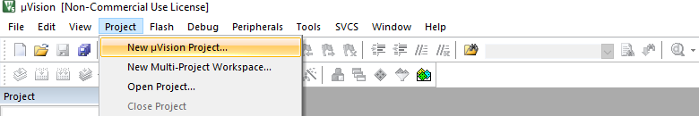

# Embedded-Systems

Repository Embedded-Systems presents suggested solutions to tasks that had to be completed in the first semester of my Master's studies within the Embedded-Systems course at the Wroclaw University of Technology in the field of Control Engineering and Robotics. The tasks were implemented on the `STM32F407G-DISC1` board equipped with the `STM32F407VG` core. The `Keil µVision 5 IDE` was used to program the board.

## Table of Contents

  - [Project Setup](#project-setup)

## Project Setup

The first step is to create a new project. From the `Keil µVision 5` program bar, select `Project` and then `New µVision Project...`. Then a window will appear where you can define the name of the project.

After defining the name of the project, select the device to be programmed. In this case, select `STMicroelectronics -> STM32F4 Series -> STM32F407 -> STM32F407VG -> STM32F407VGTx`

Then the `Manage Run-Time Environment` window appears, in which checkboxes presented in the screenshot below should be checked. In addition, in `Board Support`, select the `STM32F4-Discovery` option.

The next step is to set the appropriate settings for the debugger. Select `Options for Target...` from the program bar.

There, go to the `Debug` tab and select the option shown in the screenshot below, i.e. `ST-Link Debugger`.

To verify the correct connection with the board, click the `Settings` button visible to the right of the name of the selected debugger. If everything works correctly, the window should contain the following information.

To make it easier to work with the board, you can go to the `Flash Download` tab and check the `Reset and Run` option. This will automatically reset the board when loading a new program.

The last step of project configuration is to create the `main.c` file in which the program code will be written.

